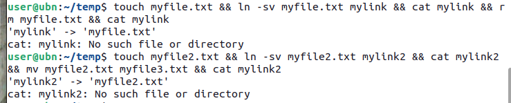
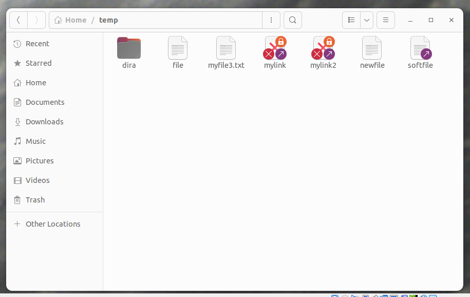
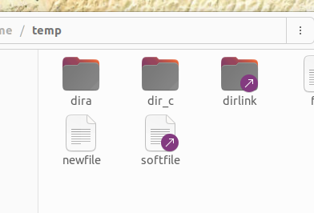
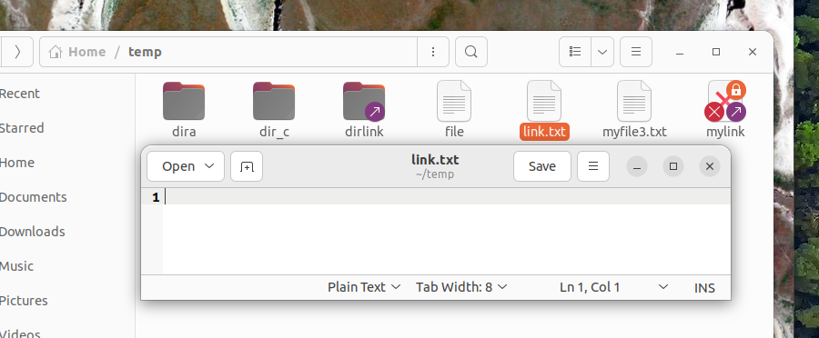

### Перемещение, переименование, удаление файлов и директорий. Жёсткие и символические ссылки.

#### 1. Перемещение и переименование файлов и директорий
Команда **`mv` (move)** используется для перемещения или переименования файлов и директорий. В отличие от копирования, при перемещении **не создаётся копия данных** — достаточно просто изменить путь к файлу или директории в файловой системе. Это действие не затрагивает данные, а лишь обновляет ссылки на них.

**Пример перемещения файла в директорию:**
```bash
mv -v file15 dir_a
```
- `-v` **(verbose)** — выводит информацию о том, что произошло.

**Пример переименования файла:**
```bash
mv -v file1 newname
```
- В этом случае файл **`file1`** будет переименован в **`newname`**.

**Перемещение (переименование) директории:**
```bash
mv dir_a dira
```
- Директория **`dir_a`** будет перемещена в новую директорию **`dira`**.

При этом важно помнить, что перемещение работает в пределах **одной файловой системы**. Если вы перемещаете файл или директорию в другую файловую систему, это будет фактически **копирование с удалением оригинала**.

#### 2. Удаление файлов и директорий
Для удаления используется команда **`rm`**. Эта команда работает как с файлами, так и с директориями, а также позволяет использовать рекурсию.

**Пример удаления файла:**
```bash
rm -v file2
```

**Пример удаления нескольких файлов и директорий:**
```bash
rm -rv file1 file2 dir1 dir2
```
- `-r` — рекурсивное удаление директорий и их содержимого.
- `-v` — выводит подробности о том, что было удалено.

Чтобы удалить всё в текущей директории, можно использовать:
```bash
rm -r *
```

**Важно!** Использование команды:
```bash
rm -rf /
```
**-f** (или **--force**): принудительно удаляет файлы без запроса подтверждения.
удаляет все файлы и директории в корневой директории, что может привести к полному уничтожению системы. Поэтому будьте очень осторожны.

#### 3. Жёсткие ссылки
**Жёсткие ссылки** — это ссылки на один и тот же файл в файловой системе. У каждого файла есть свой **inode** (уникальный идентификатор). Жёсткая ссылка создаёт дополнительный путь к этому inode, и оба пути (оригинальный и жёсткая ссылка) указывают на один и тот же файл.

**Пример создания жёсткой ссылки:**
```bash
ln -v filea samefile
```
- `ln` (**link**) — создаёт жёсткую ссылку.
- `filea` — исходный файл.
- `samefile` — жёсткая ссылка.

Жёсткие ссылки работают только для файлов, но не для директорий, так как они могут создать проблемы в файловой системе. Жёсткие ссылки полезны для **бэкапа данных**, когда вы не хотите хранить несколько копий одинаковых файлов, а просто добавляете ссылки на них.

#### 4. Символические ссылки
**Символические ссылки** (или **soft link**) — это ссылки, которые ссылаются на путь к файлу или директории, а не на сам inode. Символическая ссылка может быть создана на файл, находящийся в другом месте, и даже на файл в другой файловой системе.

**Пример создания символической ссылки:**
```bash
ln -vs filea softlink
```
- `-s` (**soft**) — ключ для создания символической ссылки.
- `-v` (**verbose**)— выводит подробности о созданной ссылке.

Символическая ссылка может ссылаться на несуществующий файл, и тогда она станет **битой** ссылкой, которая не будет работать.
```bash
touch myfile.txt && ln -sv myfile.txt mylink && cat mylink && rm myfile.txt && cat mylink
```
```bash
touch myfile2.txt && ln -sv myfile2.txt mylink2 && cat mylink2 && mv myfile2.txt myfile3.txt && cat mylink2
```



**Пример работы с директорией:**
```bash
ln -vs dir_c dirlink
```
- Создаст символическую ссылку **`dirlink`**, которая будет ссылаться на директорию **`dir_c`**.




**Просмотр символических ссылок:**
Для отображения символических ссылок и их целей используется команда **`ls -l`**. В выводе будет отображено, что это символическая ссылка, а также на какой файл или директорию она ссылается.


**Пример вывода команды `ls -l`:**
```bash
lrwxrwxrwx 1 user user   10 апр  2 16:10 mylink -> myfile.txt
```
- Первый символ **`l`** указывает, что это символическая ссылка.
- В последнем столбце показано (**myfile.txt**), на какой файл ссылается ссылка.

#### 5. Удаление ссылок
Ссылки (как жёсткие, так и символические) можно удалять с помощью команды **`rm`**.

**Пример удаления символической ссылки:**
```bash
rm -v softlink
```
- Удалит символическую ссылку **`softlink`**, но сам файл, на который она ссылается, останется.

#### Важные отличия между жёсткими и символическими ссылками
1. **Жёсткие ссылки:**
   - Ссылаются непосредственно на **inode** файла.
   - Не могут быть созданы для директорий (кроме некоторых случаев).
   - Работают только в пределах одной файловой системы.
   - Не зависят от существования исходного файла — если его удалить, ссылка всё равно будет работать (пока есть хотя бы одна ссылка на файл).

### Что такое жёсткая ссылка?
Когда ты создаёшь **жёсткую ссылку** на файл, ты создаёшь второй путь к одному и тому же файлу в файловой системе. Жёсткая ссылка указывает на те же данные, что и исходный файл. Это значит, что файл и его жёсткая ссылка имеют одинаковые данные и одинаковую ссылку на место хранения этих данных на диске.

#### Как это работает на практике:

* **Создание файла:** Когда ты создаёшь файл, например, `file.txt`, операционная система назначает ему определённое место на диске и записывает метаданные (например, имя, размер, владельца, и т.д.).

* **Создание жёсткой ссылки:** Когда ты создаёшь жёсткую ссылку на файл, например, командой `ln file.txt link.txt`, ты создаёшь дополнительный путь, который тоже будет указывать на тот же блок данных, что и оригинальный файл. При этом метаданные файла обновляются, чтобы учесть, что теперь существует несколько путей (имен), ведущих к данным.

* **Удаление исходного файла:** Когда ты удаляешь исходный файл, например, с помощью команды `rm file.txt`, операционная система не удаляет данные, а только удаляет ссылку на эти данные. Если на данные остаётся хотя бы одна жёсткая ссылка (в нашем случае, это `link.txt`), данные не удаляются с диска, и файл остаётся доступен через жёсткую ссылку.

* **Доступ через жёсткую ссылку:** Даже если исходный файл удалён, жёсткая ссылка продолжает работать. Когда ты открываешь `link.txt`, операционная система всё равно находит те же данные, которые хранились в `file.txt`. Это происходит потому, что файл и ссылка — это всего лишь разные имена для одного и того же набора данных.

    

2. **Символические ссылки:**
   - Ссылаются на **путь** к файлу или директории.
   - Могут быть созданы для директорий.
   - Могут ссылаться на файлы в других файловых системах.
   - Если исходный файл удалён, символическая ссылка становится "битой" и не будет работать.

#### Заключение
- **Перемещение** — это изменение пути к файлу, а не копирование данных.
- **Переименование** — это создание нового имени для файла или директории, что на самом деле является созданием новой жёсткой ссылки с новым именем.
- **Удаление** — это удаление ссылок на файл. Если на файл есть хотя бы одна ссылка, файл останется в файловой системе.
- **Жёсткие ссылки** — это дополнительные пути к одному файлу. Они позволяют экономить место при создании резервных копий.
- **Символические ссылки** — это ссылки на путь к файлу или директории, которые могут существовать между разными файловыми системами и могут ссылаться на несуществующие файлы.